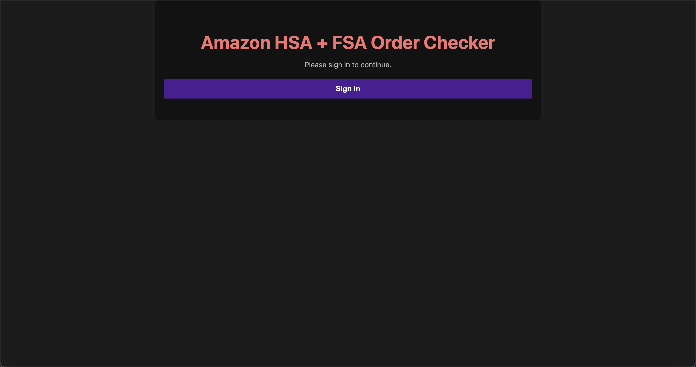
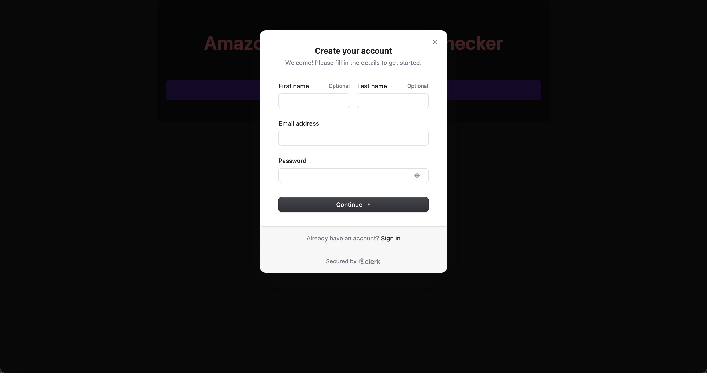
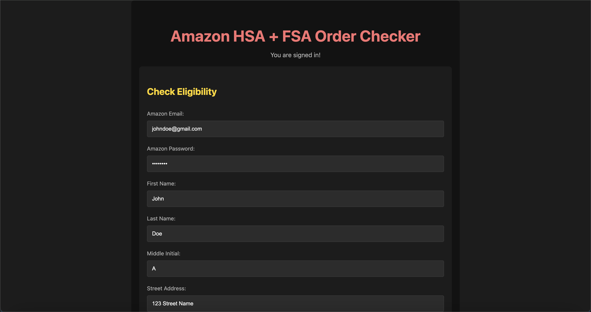
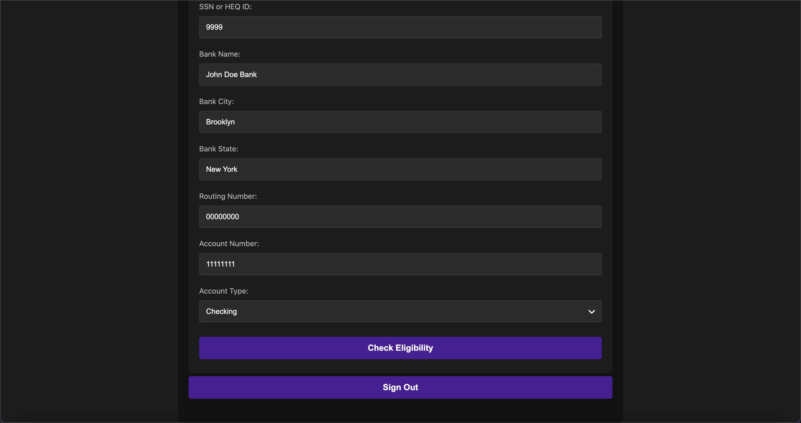
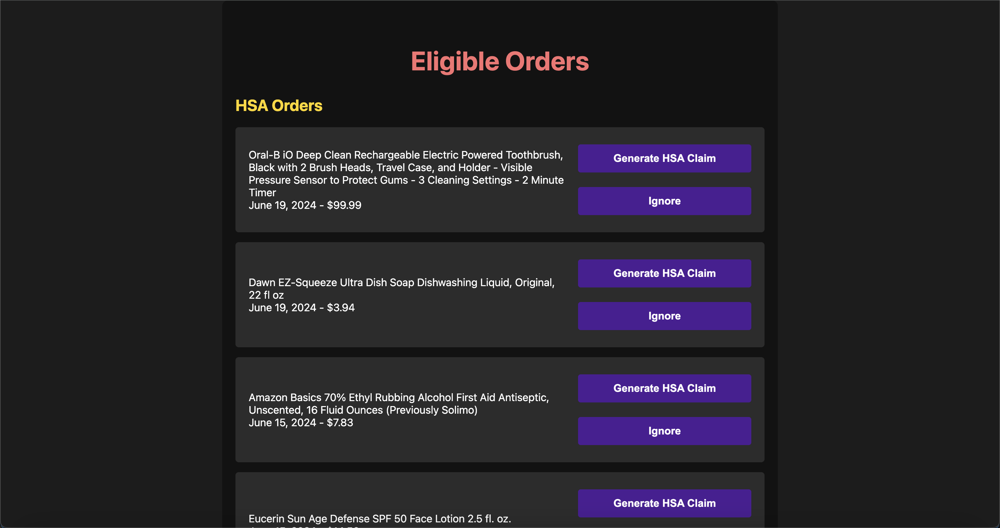
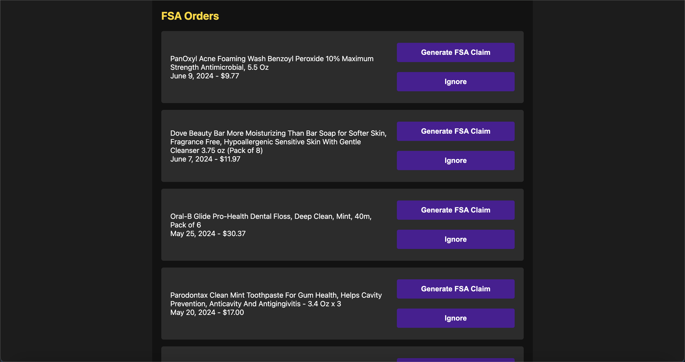

# HSA & FSA Claim Automation

## Overview

This project automates the process of checking eligibility and generating claim forms for HSA and FSA reimbursement from Amazon purchases. Users can log in, check their purchase eligibility, and generate filled PDF forms for reimbursement claims.

## Features

- **User Authentication:** Secure login using Clerk for authentication.
- **Eligibility Check:** Automatically check the eligibility of Amazon purchases for HSA and FSA reimbursement.
- **PDF Form Generation:** Generate filled PDF reimbursement forms for both HSA and FSA claims.
- **Claim History:** Maintain a history of generated claim forms.

## Setup

### Prerequisites

- Node.js (v14 or higher)
- npm (v6 or higher) or Yarn (v1.22 or higher)

### Installation

1. Clone the repository:

```bash
git clone https://github.com/your-username/hsa-fsa-claim-automation.git
cd hsa-fsa-claim-automation
```

2. Install dependencies:

   ```bash
   npm install @clerk/nextjs axios next react react-dom pdf-lib
   # or
   yarn add @clerk/nextjs axios next react react-dom pdf-lib
   ```

3. Set up environment variables:

   Create a `.env.local` file in the root directory of the project and add your Clerk keys:

   ```bash
   NEXT_PUBLIC_CLERK_PUBLISHABLE_KEY=your-clerk-publishable-key
   CLERK_SECRET_KEY=your-clerk-secret-key
   ```

4. Start the development server:

   ```bash
   npm run dev
   # or
   yarn dev
   ```

5. Open your browser and navigate to `http://localhost:3000` to see the application.

### Additional Configuration

- Ensure you have the necessary PDF forms in the `pdf-forms` directory.
- Make sure the `public/claims` directory exists for saving generated claim PDFs.

## Screenshots

### Sign-in



### Eligibility Form



### Results


```
